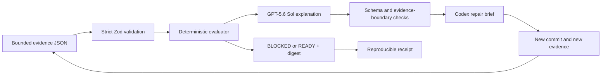

# ProofLatch

**Evidence before release.**

ProofLatch is a release decision desk for agent-written software. A bounded
evidence packet is evaluated by deterministic rules first. Those rules alone
decide `BLOCKED` or `READY`. GPT-5.6 Sol then explains the evidence and, when a
release is blocked, produces a small Codex-ready repair brief without being
allowed to change the verdict.

> Rules decide. GPT-5.6 explains. Codex repairs. New evidence reopens the latch.

ProofLatch is an OpenAI Build Week entry in the **Developer Tools** track.

- **Live app:** [prooflatch-buildweek.e-vigelis.chatgpt.site](https://prooflatch-buildweek.e-vigelis.chatgpt.site)
- **Source:** [github.com/pakales/prooflatch](https://github.com/pakales/prooflatch)

## Why this exists

Agentic coding makes it easy to produce changes quickly, but “the agent says it
works” is not release evidence. Teams still need a defensible answer to four
questions:

1. What was checked?
2. Which checks are release gates?
3. Why is this exact commit blocked or ready?
4. What is the smallest safe next action?

ProofLatch makes that decision explicit and repeatable. It does not execute
repository code, ingest source files, or let a language model improvise the
release state.

## The product loop

1. **Load evidence** — import a strict JSON packet containing repository
   coordinates and bounded check results.
2. **Latch the verdict** — deterministic rules return `BLOCKED` when any
   policy-required check is not `pass` or the working tree is dirty; otherwise
   they return `READY`.
3. **Explain the decision** — public guest mode returns a deterministic
   explanation, receipt, and bounded repair brief without a paid model call.
   An authenticated GPT-5.6 Sol path can add a schema-validated explanation
   tied only to blocking policy gates.
4. **Repair with Codex** — copy the repair brief into Codex. Every step is tied
   to a blocking check ID and includes a verification condition.
5. **Re-run with new evidence** — a changed commit or evidence packet requires a
   new evaluation and a new receipt.

The public judge path does not require sign-in. If the authenticated model path
is unavailable, ProofLatch preserves the deterministic decision and returns a
transparent deterministic explanation instead of pretending a model response
succeeded.

## Honest boundaries

- ProofLatch does **not** claim software is bug-free.
- The demo button labeled **Apply demo fix set** changes only the bundled sample
  evidence. It does not edit, test, or repair a repository.
- The full evidence digest binds the effective server policy, supplied packet,
  evaluator version, and resulting deterministic assessment. It can reveal a
  post-capture change to that data, but it is not a signature, source
  attestation, trusted timestamp, or proof that a command actually ran.
- Imported evidence is a claim from the evidence producer. Strong provenance,
  signed CI attestations, and independent command capture are future work.
- GPT-5.6 is intentionally outside the verdict path. It explains; it does not
  decide.

## Quick start

### Prerequisites

- Node.js `>=22.13.0`
- npm
- An OpenAI API key for authenticated GPT-5.6 explanations (optional for
  deterministic local operation)

### Install and run

```bash
npm ci
cp .env.example .env.local
npm run dev
```

Open [http://localhost:3000](http://localhost:3000).

For the authenticated model path, fill the server-only value in the copied
`.env.local`:

```dotenv
OPENAI_API_KEY=your_server_side_key
```

Never prefix this variable with `NEXT_PUBLIC_` and never commit `.env.local`.
The signed-out local UI remains deterministic-only even when the key exists;
an API key alone never enables anonymous model spend. Live model testing
requires a trusted hosting identity or the controlled authenticated test
harness. Without the key, an authenticated request intentionally responds in
`deterministic-fallback` mode.

### Test the public demo in 60 seconds

1. Open the live app signed out and click **Run deterministic proof**.
2. Confirm `BLOCKED`, inspect the failed test and dependency audit, and copy the
   decision receipt or bounded Codex repair brief.
3. Click **Apply demo fix set**. This is a clearly labeled fixture swap, not a
   real code repair.
4. Click **Re-run deterministic proof**.
5. Confirm `READY`, zero blockers, and a digest that differs from the blocked
   run, then copy the new receipt.
6. Optionally choose **Sign in for GPT-5.6** to add an evidence-bound model
   explanation. Sign-in never changes the deterministic verdict.

You can also choose **Import evidence** and paste either:

- [`examples/evidence/blocked.json`](examples/evidence/blocked.json)
- [`examples/evidence/ready.json`](examples/evidence/ready.json)

## Evidence contract

The accepted packet is deliberately narrow. This shape is abbreviated to one
check for readability and is not itself importable because the selected policy
requires its complete check set; use the linked fixtures for valid packets:

```json
{
  "schemaVersion": "1.0",
  "policy": {
    "id": "web-release",
    "version": "1.0.0"
  },
  "repository": {
    "name": "Atlas Checkout",
    "branch": "release/2.4.0",
    "commit": "87a9e01d51c6e9f5",
    "dirtyFiles": 0
  },
  "release": {
    "version": "2.4.0",
    "target": "Production",
    "generatedAt": "2026-07-18T10:30:00.000Z"
  },
  "checks": [
    {
      "id": "unit-suite",
      "label": "Unit and integration tests",
      "category": "tests",
      "status": "fail",
      "summary": "1 checkout idempotency test failed out of 214.",
      "command": "npm test",
      "required": true,
      "durationMs": 18440
    }
  ]
}
```

The server accepts at most 32 checks, but each selected policy defines the exact
allowed check set, labels, categories, and required flags. Missing, unknown, or
client-reclassified checks are rejected by a strict Zod schema. Source code, raw
logs, credentials, and arbitrary model instructions are neither needed nor
accepted. See
[`docs/EVIDENCE-CONTRACT.md`](docs/EVIDENCE-CONTRACT.md).

## Server-owned release policies

ProofLatch v1 ships two versioned profiles:

- `web-release@1.0.0` — executed release evidence for the interactive demo;
- `repository-baseline@1.0.0` — read-only repository structure and source-state
  evidence emitted by the local scanner. It detects test and CI signals but
  does not claim those checks ran.

The packet chooses a known profile; the server owns its semantics. A client
cannot omit a policy check, invent a check, or change whether a check is
required.

For either profile:

```text
BLOCKED = any policy-required check has status other than "pass"
          OR repository.dirtyFiles > 0

READY   = every policy-required check has status "pass"
          AND repository.dirtyFiles == 0
```

A `warn` on a required check blocks. Advisory checks may use `pass` or `warn`;
an advisory `fail` is rejected rather than silently treated as optional.
Changing policy semantics requires a new policy version and contract tests.

## Generate a repository baseline packet

The bundled scanner inspects repository metadata without running project code,
package scripts, tests, Git hooks, or network operations:

```bash
npm run scan -- --root /path/to/repository --pretty > prooflatch-evidence.json
```

Use `--require-root` when the supplied path must itself be the Git top-level,
rather than a nested directory within a parent worktree. The GitHub Action
always enables this boundary.

It checks a pinned Git HEAD, dirty/conflict state, repository-bound metadata,
sensitive-looking filenames, manifest, lockfile, and structural test/CI/README
signals. It does not read arbitrary source contents and does not claim tests
passed.

The v1 scanner deliberately blocks Git submodule/gitlink entries instead of
entering nested repositories whose source state is not covered by the parent
commit. It uses a validated absolute system Git executable from the standard
GitHub-hosted runner locations; a nonstandard Git installation is
`indeterminate`, not `READY`.

Exit codes are:

| Code | Meaning |
| --- | --- |
| `0` | Baseline ready |
| `1` | Advisory review |
| `2` | Blocked |
| `3` | Indeterminate |
| `64` | Invalid CLI usage |
| `70` | Internal scanner error |

The emitted packet uses `repository-baseline@1.0.0` and can be imported into the
web app.

## Automate the repository baseline in GitHub

The repository also contains the source and committed bundle for a token-free
Node 24 JavaScript Action. It runs the same read-only scanner, validates the
complete packet against the server-owned policy, evaluates it deterministically,
and writes a packet, receipt, and BLOCKED-only Codex brief under `RUNNER_TEMP`.

In a consumer workflow, one non-matrix job named exactly `ProofLatch` becomes
the GitHub Check that can be required by a branch ruleset:

```yaml
permissions:
  contents: read

jobs:
  prooflatch:
    name: ProofLatch
    runs-on: ubuntu-24.04
    steps:
      - uses: actions/checkout@df4cb1c069e1874edd31b4311f1884172cec0e10 # v6
        with:
          persist-credentials: false
      - uses: pakales/prooflatch@v1
        with:
          path: .
          target: Pull request repository baseline
```

For production, replace `@v1` with the immutable release commit SHA published
in the [v1.0.0 release](https://github.com/pakales/prooflatch/releases/tag/v1.0.0).
The moving major tag is provided as a convenient compatibility alias.

The Action does not use a GitHub token, call OpenAI, access the ProofLatch web
API, execute project commands, or accept a `fail-on-blocked` bypass. `BLOCKED`
always fails the job after outputs and local artifact paths have been written.
Its `path` must identify the actual Git worktree root; a nested parent worktree
is rejected as indeterminate.

Important: `READY` from this Action means
`repository-baseline@1.0.0` passed. It proves structural source-state signals,
not that tests, a build, an audit, or a browser flow executed. See the complete
[GitHub Action contract](docs/GITHUB-ACTION.md) and
[consumer workflow](examples/github/prooflatch.yml).

The public Action slug is `pakales/prooflatch@v1`. Release tags and the exact
immutable commit are published on
[GitHub Releases](https://github.com/pakales/prooflatch/releases).

## GPT-5.6 integration

The server uses the OpenAI Responses API with:

- explicit model `gpt-5.6-sol`
- structured outputs parsed against a strict Zod schema
- `reasoning.effort: "medium"`
- `store: false`
- zero automatic SDK retries
- a bounded request timeout

The model output schema contains no verdict field. The server also rejects model
risks or repair steps that reference anything other than authoritative blocking
gate IDs. A `BLOCKED` explanation must contain at least one risk and one repair
step; a `READY` response must contain neither.

## Production configuration

Production exposes the deterministic evaluator as a signed-out guest path.
Guest requests return after validation and evaluation, before D1 quota access
or any paid model call. The optional GPT-5.6 path uses server-side Sign in with
ChatGPT identity and a persistent D1 quota before model execution. Configure:

| Setting | Kind | Purpose |
| --- | --- | --- |
| `OPENAI_API_KEY` | secret environment variable | Server-side Responses API calls |
| `PROOFLATCH_QUOTA_SALT` | secret environment variable | HMAC pseudonymization for quota keys |
| `PROOFLATCH_SITE_URL` | environment variable | Canonical deployed origin for metadata |
| `DB` | D1 binding | Persistent per-user usage quota |

Do not store raw email addresses in quota records. Sign in with ChatGPT proves
identity, not workspace membership; deployment access policy remains a separate
control. The current quota allows three model calls per minute and twenty per
day for each HMAC-pseudonymized user, with quota records expiring after thirty
days. These operational limits should be tuned only with real traffic and spend
telemetry.

The target host is OpenAI Sites. The binding declaration lives in
`.openai/hosting.json`; production secrets are configured through the hosting
control plane, never committed to the repository.

## Validation

Run the release checks from a clean checkout:

```bash
npm run verify
```

`verify` first confirms the committed Action bundle matches its TypeScript
source, then runs type-checking, lint, deterministic, scanner, Action and API
tests, a production build plus rendered-worker checks, and the production
dependency audit.

Then perform the blocked-to-ready browser flow at desktop and mobile widths and
inspect browser console errors. The detailed matrix and expected results are in
[`docs/TESTING.md`](docs/TESTING.md).

## Architecture



The full trust model, fallback behavior, and component map are documented in
[`docs/ARCHITECTURE.md`](docs/ARCHITECTURE.md) and
[`docs/THREAT-MODEL.md`](docs/THREAT-MODEL.md).

## Built with Codex

Codex was used as the implementation partner for product framing, architecture,
deterministic evaluator design, GPT-5.6 integration, strict schemas, security
review, responsive interface work, tests, documentation, and release
validation. GPT-5.6 Sol is used at runtime only for evidence-bound explanation
and bounded repair planning.

Build Week feedback/session reference:

```text
019f7221-2421-78e3-b12e-f6082da1ed87
```

Use this same real session ID in the event's `/feedback` field.

## Documentation

- [Architecture](docs/ARCHITECTURE.md)
- [Evidence contract](docs/EVIDENCE-CONTRACT.md)
- [Testing](docs/TESTING.md)
- [Threat model](docs/THREAT-MODEL.md)
- [Devpost submission copy](docs/SUBMISSION.md)
- [2:50 demo script](docs/DEMO-SCRIPT.md)
- [Final submission checklist](docs/SUBMISSION-CHECKLIST.md)

## License

[MIT](LICENSE) © 2026 Evl Labs
