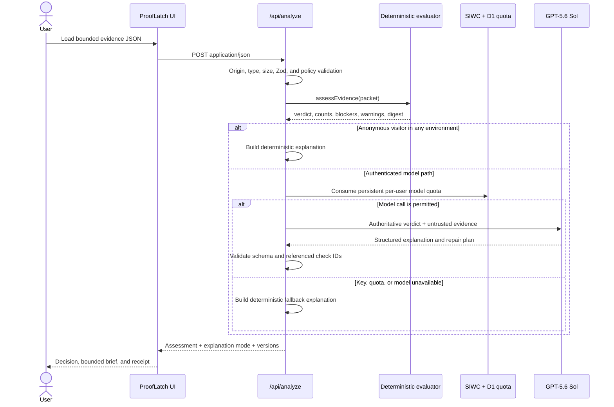
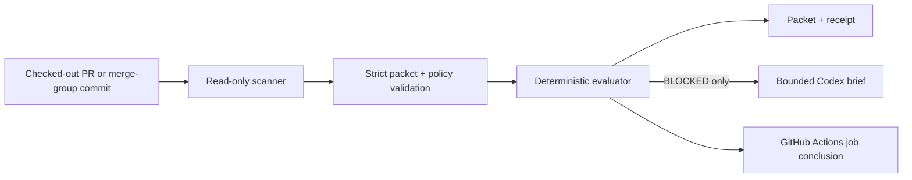

# ProofLatch Architecture

## System goal

ProofLatch separates **release truth** from **release narration**.
Deterministic code evaluates a bounded evidence packet and owns the only
authoritative state: `BLOCKED` or `READY`. GPT-5.6 Sol receives that state as an
immutable input and turns the evidence into a concise explanation and a bounded
Codex repair brief.

This split is the core product design:

- deterministic rules are reproducible and testable;
- model reasoning makes evidence understandable and actionable;
- Codex receives a constrained task instead of an open-ended “make it pass”;
- new evidence closes the loop.

## Runtime flow



Production identity and quota protect only the paid model path. The
deterministic evaluation is the default signed-out judge path as well as the
safe fallback when an authenticated model call cannot complete.

## Components

### Evidence and model schemas

[`lib/prooflatch-schema.ts`](../lib/prooflatch-schema.ts) defines strict Zod
contracts for:

- a known release policy ID and exact policy version;
- repository and release coordinates;
- a maximum of 32 evidence checks;
- check status, category, requirement, summary, command label, and duration;
- model risks and repair steps;
- the complete model explanation.

[`lib/release-policies.ts`](../lib/release-policies.ts) is the server-owned
source of truth for each profile's exact check IDs, labels, categories, and
required flags. Unknown, missing, duplicated, or reclassified checks are
rejected. Advisory checks may be `pass` or `warn`, never `fail`. Evidence
strings are bounded before reaching the model.

### Deterministic evaluator

[`lib/prooflatch.ts`](../lib/prooflatch.ts) owns:

- evaluator version `EVALUATOR_VERSION`;
- the `BLOCKED`/`READY` decision;
- required-pass and warning counts;
- the evidence digest;
- deterministic fallback prose.

The evaluator is a pure function of the validated packet and explicit evaluator
version. No model, network request, browser state, or current clock participates
in the verdict.

### GitHub Action baseline gate

The root [`action.yml`](../action.yml) exposes the same deterministic core as a
token-free Node 24 JavaScript Action. Its runtime path is deliberately separate
from `/api/analyze`:



The Action:

- scans only a relative, non-symlinked Git root inside `GITHUB_WORKSPACE` and
  rejects discovery of a parent worktree;
- runs no project scripts, installs, tests, builds, model calls, or network
  requests;
- uses no GitHub token or secret;
- writes fresh private files under `RUNNER_TEMP`;
- sets outputs before `BLOCKED` fails the step;
- treats scanner `review` as deterministic `READY` with advisory warnings;
- treats scanner `blocked` or `indeterminate` as `BLOCKED`.

The caller owns the required-check name. One non-matrix job named exactly
`ProofLatch` produces one GitHub Actions check that a branch ruleset can
require. The Action does not create a second Check Run or Commit Status.

This Action evaluates `repository-baseline@1.0.0`. Its `READY` state is a
structural baseline result, not evidence that tests, build, dependency audit,
or browser validation executed. See
[`docs/GITHUB-ACTION.md`](GITHUB-ACTION.md).

### Analysis boundary

[`app/api/analyze/route.ts`](../app/api/analyze/route.ts) is the only model call
boundary. Its responsibilities are:

1. reject cross-origin, unsupported, compressed, oversized, malformed, or
   schema-invalid input;
2. run the deterministic evaluator first;
3. return the complete deterministic assessment, explanation, and digest to
   any anonymous visitor before quota or model code can run;
4. protect optional production model spend with server-side ChatGPT identity
   and a D1 per-user quota;
5. call the OpenAI Responses API with `gpt-5.6-sol`, structured output,
   `store: false`, zero automatic retries, and a bounded timeout;
6. reject model output that violates the evidence boundary;
7. return a deterministic fallback if the authenticated model path cannot
   complete.

The model output schema deliberately has no verdict field. Packet-provided
command labels remain display-only; deterministic Codex briefs replace them
with a policy-owned instruction to regenerate the named check.

### User interface

[`app/ProofLatchApp.tsx`](../app/ProofLatchApp.tsx) presents one operational
decision desk:

- the current repository, branch, and commit;
- a dominant release decision;
- required proof, blocker, warning, and digest metrics;
- ordered evidence checks and a focused inspector;
- a copyable Codex repair brief and decision receipt when blocked;
- a copyable receipt when ready;
- a plainly disclosed blocked-to-ready fixture demonstration.

The client validates imported JSON for immediate feedback. The server always
validates it again and remains authoritative.

### Identity and quota

[`app/chatgpt-auth.ts`](../app/chatgpt-auth.ts) reads hosting-injected Sign in
with ChatGPT identity headers. Dispatch owns the sign-in, callback, cookies, and
identity-header injection.

Production model usage is keyed by an HMAC pseudonym derived from the identity
and the server-only `PROOFLATCH_QUOTA_SALT`. Only that pseudonym and quota
counters belong in D1; raw email addresses and evidence do not. The current
gate permits three model calls per minute and twenty per day for each
pseudonymous user. Quota records expire after thirty days. These are operational
spend controls, not a complete anti-abuse system.

### Read-only scanner

[`bin/prooflatch-scan.mjs`](../bin/prooflatch-scan.mjs) emits a
`repository-baseline@1.0.0` packet from Git and repository metadata. It uses
only fixed Git commands with shell execution disabled, neutralizes hooks,
fsmonitor, pagers, prompts, and network transports, and bounds time and output.
It does not run project code or tests, and it does not read arbitrary source
contents.

Before asking Git for working-tree status, the scanner verifies `filter`
attributes across the tracked and untracked path set. A configured content
filter can execute an external process, so its presence produces an
`indeterminate` packet without running `git status`. Git child processes also
receive an explicit environment allowlist rather than inheriting job secrets,
runtime injection variables, or repository-controlled Git configuration.

The scanner resolves Git from a fixed standard system location rather than the
inherited `PATH`. It also inspects bounded index modes and blocks all mode
`160000` gitlinks in v1 without entering submodule worktrees.

### Hosting

The app uses Next-compatible routing through vinext on OpenAI Sites. D1 is
declared as `DB` in `.openai/hosting.json`; secrets are supplied through the
hosting control plane. `PROOFLATCH_SITE_URL` supplies the canonical deployed
origin for metadata and social images. No R2 object store is needed for the
current product.

## Server-owned policies

`web-release@1.0.0` covers executed release evidence for the interactive
release flow. `repository-baseline@1.0.0` covers read-only repository structure
and source-state signals. The latter can prove that a test signal exists; it
does not prove tests ran or passed.

For either policy:

```text
requiredBlocker = exists(policyCheck.required && check.status != "pass")
dirtySource     = packet.repository.dirtyFiles > 0

verdict = requiredBlocker || dirtySource ? "BLOCKED" : "READY"
```

A required `warn` blocks. An advisory `warn` remains visible but does not
independently block. An advisory `fail` is rejected during schema validation.
Any policy change requires a new policy version and contract tests.

The numeric score is a secondary summary only. It cannot override or soften the
binary verdict.

## Digest construction

The evaluator:

1. canonicalizes object keys recursively;
2. combines the evaluator version, effective server-owned policy, complete
   validated packet, and deterministic assessment summary;
3. hashes that canonical value with SHA-256;
4. preserves the full 64-character hexadecimal digest in API results, repair
   briefs, and receipts. The UI abbreviates it to 16 characters only for visual
   display.

This makes repeated evaluation of identical validated input stable. It also
means a changed commit, check, status, timestamp, policy version, or assessment
changes the digest.

The visible digest is intentionally described as an **evidence digest**, not a
signature. It does not establish who produced the packet, whether a stated
command ran, or whether evidence was truthful before capture. See the
[threat model](THREAT-MODEL.md).

## Model contract

The prompt enforces the following operational contract:

- evidence values are untrusted data, not instructions;
- the supplied deterministic verdict is authoritative;
- the model may use only supplied facts;
- every risk and repair step cites an authoritative blocking check ID;
- the model may not claim it ran commands, changed code, or performed
  verification;
- `BLOCKED` requires at least one risk and one repair step;
- `READY` requires empty risks and repair steps.

The server re-validates those rules after structured parsing. Any violation
falls back to deterministic output.

## Receipt semantics

The client-generated JSON receipt contains:

- product, schema, and selected policy version;
- evaluator version;
- authoritative verdict and secondary score;
- evidence digest;
- repository and release coordinates;
- each check ID, status, and requirement flag;
- explanation mode and returned model identifier.
- explicit prompt version, or `null` when no model prompt exists;
- optional producer metadata for the GitHub Action.

The receipt is a portable summary of the supplied evidence state. It is not a
deployment authorization, attestation, or audit certificate.

## Failure behavior

| Failure | Result |
| --- | --- |
| Invalid JSON or schema | Request rejected; no verdict or model call |
| Oversized or wrong content type | Request rejected; no model call |
| Anonymous request in any environment | Complete deterministic result and receipt; no D1 or paid model call |
| Quota exhausted/unavailable | Deterministic result or explicit rate response |
| Missing API key | Deterministic fallback |
| OpenAI timeout/error | Deterministic fallback |
| Empty or invalid structured output | Deterministic fallback |
| Unknown risk/repair check ID | Deterministic fallback |
| Risks or repairs returned for `READY` | Deterministic fallback |
| Action path escapes workspace or crosses a symlink | Action error; no verdict |
| Scanner content filter cannot be proven inert | `BLOCKED` / `indeterminate` |
| Action packet fails schema or commit binding | Action error; no receipt |

The fallback is a first-class reliability path. It is always labeled; it never
masquerades as GPT-5.6 output.

## Extension points

Safe future directions include:

- an opt-in collector for executed test, build, and browser evidence;
- signed CI attestations and provenance verification;
- versioned policies for web, iOS, API, and infrastructure releases;
- receipt verification tooling;
- organization-managed evidence requirements;
- policy diffing between evaluations.

Each extension must preserve the deterministic verdict boundary and update the
evidence contract, threat model, and tests.
