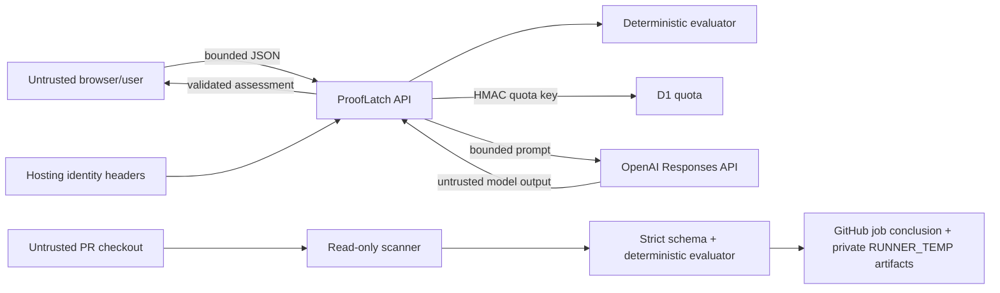

# ProofLatch Threat Model

## Scope

This document covers the ProofLatch web application, its evidence import and
analysis API, Sign in with ChatGPT identity, D1 quota storage, OpenAI Responses
API call, local scanner, bundled GitHub Action, generated repair briefs, and
receipts.

It does not treat the supplied evidence as independently authenticated. CI
systems, source hosts, artifact signing, and deployment platforms are outside
the v1.0 trust boundary.

## Security goals

1. A model cannot alter the deterministic verdict.
2. Untrusted packet content cannot become instructions or executable code.
3. Anonymous or abusive traffic cannot create unbounded model spend.
4. API keys, quota salts, and raw user identity stay server-side.
5. Invalid or oversized input is rejected before a model call.
6. A model failure cannot erase or fabricate the deterministic result.
7. Public output does not overstate evidence provenance.
8. A pull request cannot make the Action execute project code or inherit job
   secrets through the scanner's Git child processes.

## Assets

- integrity of the `BLOCKED`/`READY` decision;
- OpenAI API budget and availability;
- `OPENAI_API_KEY` and `PROOFLATCH_QUOTA_SALT`;
- authenticated user identity;
- quota counters and pseudonymous identity keys;
- evidence packet privacy;
- trustworthiness of receipts and public product claims;
- service availability.

## Trust boundaries

- Browser input is untrusted, including every evidence string.
- Hosting-injected identity headers are trusted only when received through the
  production dispatch path; client-supplied lookalike headers are not identity.
- Model output is untrusted until schema and semantic validation succeed.
- D1 is trusted to persist quota state, not evidence truth.
- Repository and CI claims inside a packet are not authenticated in v1.0.
- The GitHub Action trusts its own pinned bundle and scanner, but treats the
  checked-out repository, its metadata, names, attributes, and working tree as
  untrusted.

## Threats and controls

### Prompt injection through evidence

**Threat:** a check label, summary, branch, or command contains instructions
designed to override the model prompt.

**Controls:**

- strict schemas and field length bounds;
- explicit instruction that the packet is untrusted data;
- deterministic verdict computed before the model call;
- no verdict field in the model output schema;
- no model tools, shell, file, browser, or network capabilities;
- post-parse validation restricts risks and steps to authoritative blocker IDs;
- fallback on any semantic violation.

**Residual risk:** model prose could still be misleading within allowed fields.
The UI must label it as an explanation and keep deterministic facts dominant.

### Verdict manipulation

**Threat:** a model or client attempts to report `READY` despite non-passing
required evidence.

**Controls:**

- the server computes and returns the verdict;
- the client never accepts a model-supplied verdict;
- READY output is required to have no risks or repair steps;
- evaluator contract tests cover required failures, required warnings, policy
  weakening, and contradictory dirty-source evidence.

**Residual risk:** a malicious evidence producer can submit false passing
claims. Provenance is a separate problem.

### Evidence forgery and replay

**Threat:** a user fabricates, edits, or reuses a packet while presenting its
receipt as independent proof.

**Controls:**

- digest binds the effective server policy, complete validated packet,
  evaluator version, and assessment;
- repository commit and generation timestamp are visible;
- any changed packet creates a new digest;
- product copy explicitly limits receipt semantics.

**Residual risk:** the full 64-character digest is not a signature, source
attestation, nonce, trusted timestamp, or replay prevention mechanism. A
truthful-looking packet can be fabricated before hashing. The UI's 16-character
abbreviation is only a display convenience.

### Secret exposure

**Threat:** API credentials or HMAC salt leak through git, client bundles,
responses, logs, screenshots, or model context.

**Controls:**

- secrets live only in `.env.local` or hosting secret variables;
- `.env*` files are gitignored;
- no `NEXT_PUBLIC_` secret variables;
- response bodies omit secrets, raw identity, OpenAI response IDs, and internal
  exceptions;
- evidence contract discourages logs and environment dumps;
- video checklist includes a secret/identity inspection.

**Residual risk:** operator error in hosting configuration or screen recording.
Rotate an exposed secret immediately and inspect access logs and spend.

### Paid API abuse

**Threat:** anonymous, automated, or distributed clients create uncontrolled
model usage.

**Controls:**

- server-side Sign in with ChatGPT identity in production;
- persistent D1 per-user quota before the model call;
- HMAC-pseudonymized identity keys;
- same-origin checks and bounded request handling;
- zero automatic SDK retries and a timeout;
- deterministic fallback when a model call is unavailable.

The current application quota is three model calls per minute and twenty per
day for each HMAC-pseudonymized user. Pseudonymous quota records expire after
thirty days.

**Residual risk:** authenticated account farms, distributed identities, burst
races, and denial-of-service remain possible. Quotas are a spend control, not a
complete abuse-prevention system. Production should also use platform
observability, spend alerts, and WAF/rate controls where available.

### Identity spoofing

**Threat:** a request supplies a fake
`oai-authenticated-user-email` header.

**Controls:**

- identity is read server-side through hosting dispatch;
- production must not trust a development header bypass;
- paid model use fails closed when identity is absent.

**Residual risk:** Sign in with ChatGPT establishes identity, not organization
membership or authorization to private project data. If workspace restrictions
are needed, enforce them separately through hosting access policy or an
allowlist.

### Quota privacy

**Threat:** stored quota keys expose user email addresses or allow offline
enumeration.

**Controls:**

- derive the key with HMAC and `PROOFLATCH_QUOTA_SALT`;
- store no raw email, full name, evidence, or model response;
- keep salt server-only and rotate it intentionally.

**Residual risk:** quota data still represents pseudonymous usage behavior.
Limit retention and database access. Salt rotation changes identity keys and
therefore resets effective counters unless migrated.

### Request smuggling, decompression, and memory pressure

**Threat:** an attacker omits or lies about content length, sends compressed
content, oversized streams, deeply shaped data, or ambiguous content types.

**Controls:**

- exact JSON media-type handling;
- reject unsupported content encoding;
- enforce a byte limit while reading the stream, not only from
  `Content-Length`;
- strict schema, bounded arrays, bounded strings, and no recursive user shape;
- no raw body logging.

**Residual risk:** distributed request volume can still consume worker time.
Platform-level rate and concurrency controls remain necessary.

### Cross-origin request abuse

**Threat:** another origin causes a signed-in browser to invoke the analysis
route.

**Controls:**

- same-origin validation;
- JSON-only POST;
- hosting-owned authentication cookies and dispatch;
- per-user quota limits impact even if another control fails.

**Residual risk:** requests without an `Origin` header are possible outside a
browser. Authentication and quota, not origin alone, protect paid usage.

### Supply-chain and runtime compromise

**Threat:** a vulnerable dependency, deployment misconfiguration, or compromised
hosting/runtime changes application behavior.

**Controls:**

- checked-in lockfile;
- production dependency audit;
- lint, type, build, and automated tests;
- explicit model ID and policy versions;
- no arbitrary repository command execution in the web app;
- release receipt tied to the submitted source commit.

**Residual risk:** audits cover known advisories, not unknown vulnerabilities.
Keep dependencies narrow and review updates.

### Local scanner abuse

**Threat:** a hostile repository triggers Git hooks, fsmonitor, a pager,
credential prompt, network transport, symlink escape, unbounded output, or
source-content disclosure during packet generation.

**Controls:**

- validated absolute system Git executable, independent of inherited `PATH`,
  and scanner-owned argument arrays with `shell: false`;
- hooks, fsmonitor, pagers, prompts, global/system Git config, and network
  transports disabled;
- allowlisted child environment that excludes tokens, API keys, proxies,
  `NODE_OPTIONS`, and Git configuration injection variables;
- a pre-status `git check-attr --stdin -z filter` guard covering tracked and
  untracked paths; configured content filters stop the scan before they could
  execute;
- time and stdout/stderr limits;
- repository-root containment and metadata symlink checks;
- bounded index-mode inspection that blocks Gitlink/submodule boundaries without
  entering the nested worktree;
- bounded file count and manifest size;
- output contains summaries and counts, not filenames or source contents;
- tests use canaries to prove project scripts and hostile metadata are not
  executed or disclosed.

**Residual risk:** sensitive-filename detection is heuristic, structural
test/CI signals do not prove execution, v1 does not support submodule
repositories, and a nonstandard Git installation fails indeterminate. Run the
scanner only against local repositories the operator is permitted to inspect.

### GitHub Action and untrusted pull requests

**Threat:** a fork pull request obtains write credentials, executes
attacker-controlled project code, escapes the selected workspace path, injects
workflow commands through metadata, or weakens `BLOCKED` into a successful
required check.

**Controls:**

- documented trigger is `pull_request`, never privileged
  `pull_request_target`;
- caller permissions are `contents: read`, and the Action accepts no token,
  secret, policy, command, arbitrary receipt path, or `fail-on-blocked` input;
- the selected path must be relative, remain inside the real
  `GITHUB_WORKSPACE`, contain no symlink traversal, and equal the discovered Git
  top-level so a parent worktree is never inspected;
- the trusted scanner path is resolved from the executing bundle location, not
  from a caller-controlled or composite-only action-path variable;
- the Action launches only its pinned scanner with `shell: false`, bounded
  output and time, and an allowlisted environment;
- the scanner never runs repository scripts, installs, tests, builds, hooks,
  content filters, or packet commands;
- annotations use policy-owned IDs, labels, and statuses rather than untrusted
  packet prose;
- artifacts are created exclusively in a new private `RUNNER_TEMP` directory;
- outputs and receipt are written before an authoritative `BLOCKED` sets a
  failing job conclusion;
- no custom Checks API or Commit Status API is called.

**Residual risk:** a pull request may modify its caller workflow while keeping
the same job name, fork workflows may require maintainer approval before the
required check starts, and self-hosted runners may expose resources outside
GitHub's ephemeral runner boundary. Protect workflow changes with required
review or centrally managed workflow rules, and prefer GitHub-hosted runners
for untrusted contributions.

The Action's `READY` result is intentionally labeled as a repository baseline.
It does not authenticate the producer or prove that tests, builds, audits, or
browser flows executed.

## Privacy posture

ProofLatch v1.0 is designed to avoid retaining evidence:

- the API processes a bounded packet for the current request;
- OpenAI requests use `store: false`;
- D1 stores only quota state under an HMAC pseudonym;
- receipts are generated in the client and copied only when the user asks;
- Action packet, receipt, and optional Codex brief files stay in a fresh
  `RUNNER_TEMP` directory unless the caller explicitly uploads them;
- raw source, logs, diffs, secrets, and identity are outside the contract.

Operators should still treat evidence summaries as potentially confidential and
avoid including client names, private vulnerabilities, or personal data in a
public demo.

## Abuse and incident response

If model spend or traffic is abnormal:

1. disable or reduce the paid model quota while preserving deterministic mode;
2. inspect aggregate hosting and OpenAI usage without logging packet content;
3. rotate `OPENAI_API_KEY` if exposure is suspected;
4. rotate `PROOFLATCH_QUOTA_SALT` only with awareness that quota keys change;
5. patch and redeploy;
6. document the incident and update this threat model.

If a receipt is presented beyond its stated meaning, correct the claim. Do not
retroactively describe the digest as authentication.

## Pre-release security gate

- [ ] Production requires real hosting-injected identity for paid calls.
- [ ] D1 quota persists across worker restarts.
- [ ] Quota records contain no raw email or evidence.
- [ ] Missing key, salt, identity, or D1 cannot create unlimited paid use.
- [ ] Body size is enforced while reading and compressed input is rejected.
- [ ] Invalid packets cause zero model calls.
- [ ] Model semantic violations fall back deterministically.
- [ ] Responses and logs contain no secret or raw identity.
- [ ] `npm audit --omit=dev` has no unresolved release blocker.
- [ ] Anonymous and authenticated production smoke checks are recorded.
- [ ] Public copy preserves the digest and demo limitations.
- [ ] Action bundle matches source and runs without runtime dependency install.
- [ ] Fork-safe scanner tests prove child-env secret exclusion and content
      filters do not execute.
- [ ] Example workflow uses `pull_request`, `contents: read`, one stable
      `ProofLatch` job, and `merge_group` when merge queue is enabled.
- [ ] Branch ruleset change, Action publication, and release tags remain
      separately approved external actions.
